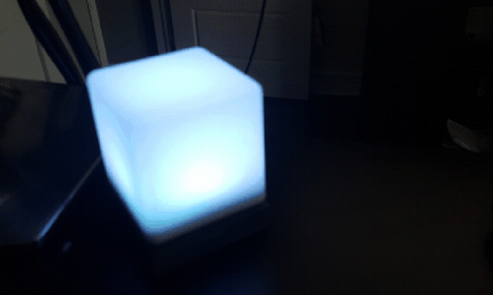
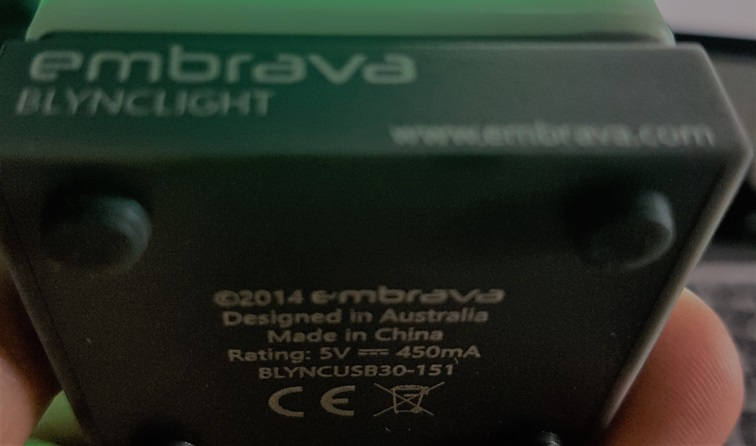

# Blync BLYNCUSB30 for Node.js

This library lets you control a [Blync](http://www.blynclight.com/) model : BLYNCUSB30  (RGB led for
USB).




This project is a fork of [justmoon's repo : node-blync](https://github.com/justmoon/node-blync)

Made by decompiling the .dll library from [the Blynclight SDK found here](https://www.embrava.com/pages/embrava-software-sdk)

## Installation

### Prerequisites

We use the NPM module `node-hid` which has a few dependencies:

 * Mac OS (I use 10.6.8) or Linux (kernel 2.6+) or Windows XP+
 * libudev-dev (Linux only)
 * libusb-1.0-0-dev (Ubuntu versions missing libusb.h only)

### Windows

```sh
npm install blync-usb30
```

### Ubuntu

``` sh
sudo apt-get install libudev-dev libusb-1.0-0-dev
npm install blync-usb30
```

### MacOS

```sh
npm install blync-usb30
```

## Usage - Example

``` js
var blync = require('blync-usb30');

try {
    // How many Blyncs are hooked up?
    var deviceCount = blync.getDevices().length;

    var device = blync.getDevice(0);
} catch (error) {
    throw new Error("Error: " + error);
}

// Make Blync light up
device.setColor('white', 'on');
device.setColor('red', 'on');
device.setColor('blue', 'on');
device.setColor('green', 'on');

// Make Blync light up with controls
device.setColor('green', 'dim');
device.setColor('green', 'blinkveryfast');
device.setColor('green', 'blinkfast');
device.setColor('green', 'blinknormal');

// Switch off - Any color is correct
device.setColor('green', 'off');

// Turn Blync off when you exit
process.on( 'SIGINT', function() {
  device.turnOff();
  process.exit(0);
});
```
